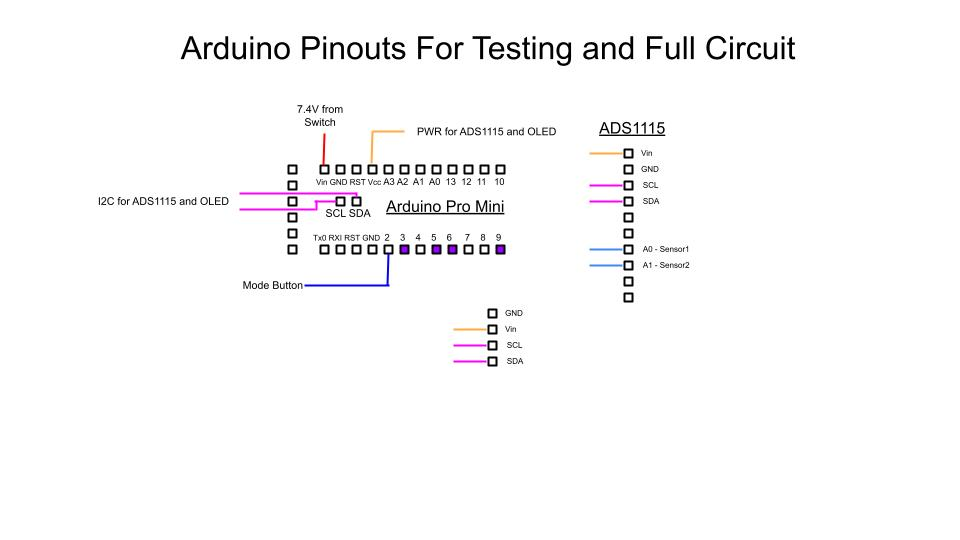

# DIYNitroxSensor
Attempt to create an easy to assemble Kitable Nitrox Sensor for analyzing Scuba tank oxygen content
Mostly for remote dive locations that may lack financial resources
This project borrows heavily on https://www.divetech.com/post/the-20-nitrox-analyzer

This repository will mostly contain arduino code files and KiCAD files. 

The main project page can be found on instructables: https://www.instructables.com/

The 3D printer files can be found on Thingiverse: https://www.thingiverse.com/thing:6300317

I have been a consumer of many of these amazing DIY sites for so many years and have never tried to put together a great tutorial myself, so here goes nothing...

This is a diagram of the basic connections for the arduino pro mini below:

  
  

